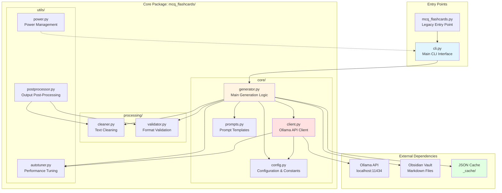
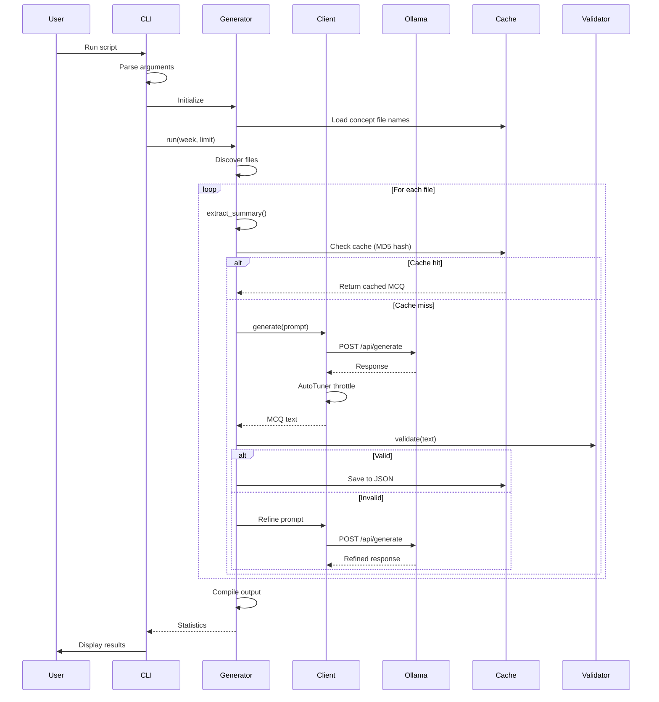
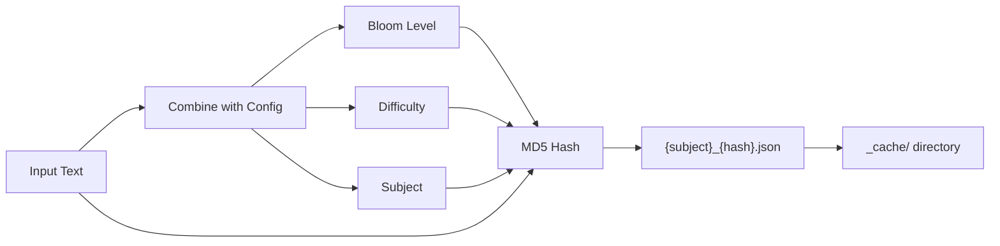
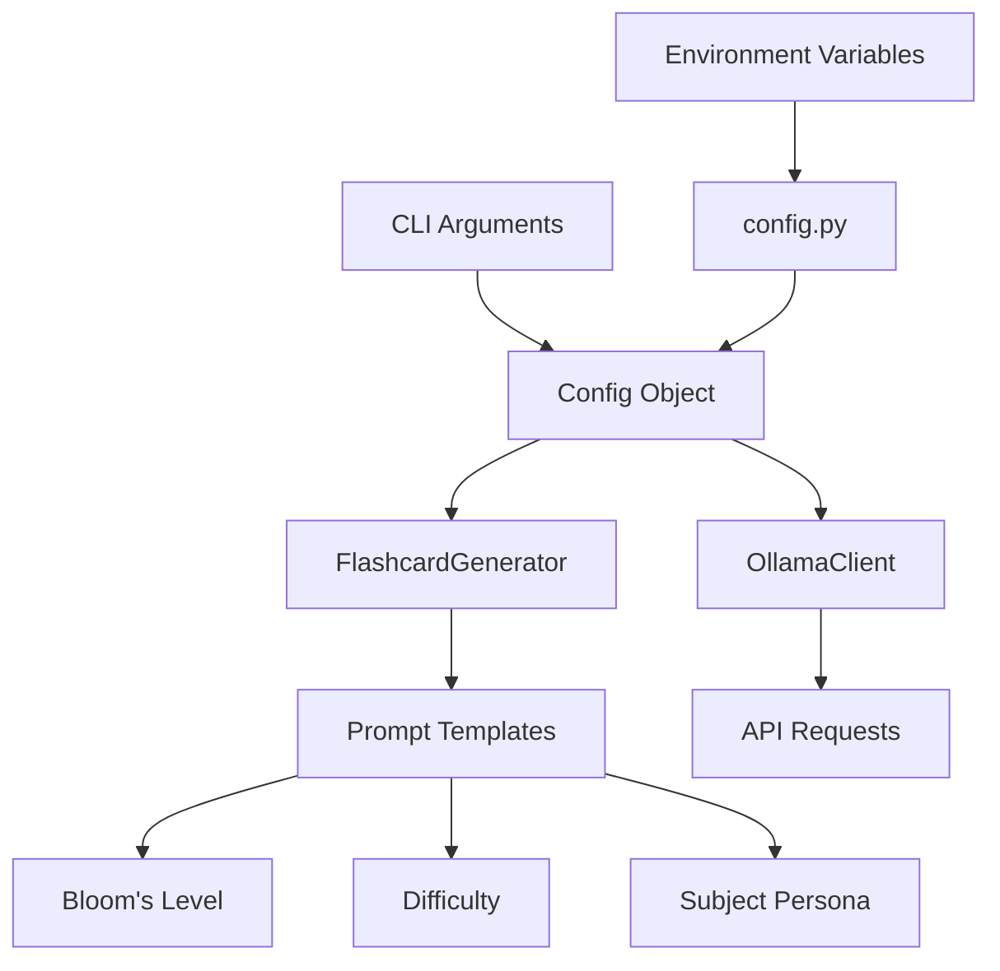
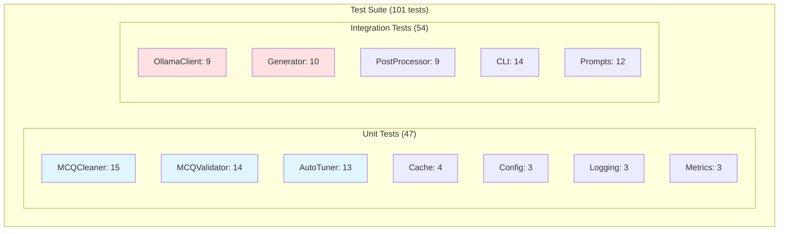

# Architecture

This document describes the architecture of the MCQ Flashcard Generator.

## System Overview

## Module Responsibilities

### Entry Points

#### `cli.py`
- **Purpose**: Main command-line interface
- **Responsibilities**:
  - Argument parsing (interactive & dev modes)
  - User interaction (semester, subject, week selection)
  - Study mode preset selection
  - Cache management
  - Orchestrates `FlashcardGenerator`
- **Key Functions**: `main()`, `run_interactive()`, `run_dev()`, `execute_generation()`

#### `mcq_flashcards.py`
- **Purpose**: Backwards-compatible entry point
- **Responsibilities**: Delegates to `cli.main()`

### Core Package

#### `core/config.py`
- **Purpose**: Centralized configuration and constants
- **Responsibilities**:
  - Path configuration (VAULT_ROOT, CACHE_DIR, etc.)
  - Default settings (model, workers, retries)
  - Logging setup with rotation
  - Data structures (`Config`, `ProcessingStats`)
  - Input validation
- **Key Classes**: `Config`, `ProcessingStats`
- **Key Functions**: `setup_logging()`, `get_semester_paths()`

#### `core/client.py`
- **Purpose**: Ollama API communication
- **Responsibilities**:
  - HTTP requests to Ollama API
  - Exponential backoff retry logic
  - AutoTuner integration for throttling
  - Connection health checks
- **Key Classes**: `OllamaClient`
- **Key Methods**: `generate()`, `check_connection()`

#### `core/generator.py`
- **Purpose**: Main flashcard generation orchestrator
- **Responsibilities**:
  - File discovery and processing
  - Wikilink extraction
  - Concept file caching
  - Multi-threaded generation
  - Cache management (JSON)
  - Progress tracking
  - Performance metrics
- **Key Classes**: `FlashcardGenerator`
- **Key Methods**: `run()`, `process_week()`, `generate_single()`, `extract_summary()`

#### `core/prompts.py`
- **Purpose**: LLM prompt templates
- **Responsibilities**:
  - System prompt templates
  - Generation prompt templates
  - Refine prompt templates
  - Bloom's taxonomy instructions
  - Difficulty level instructions
  - Subject-specific personas
- **Key Constants**: `SYSTEM_PROMPT_TEMPLATE`, `GENERATION_PROMPT_TEMPLATE`, `BLOOM_INSTRUCTIONS`

### Processing

#### `processing/cleaner.py`
- **Purpose**: Text cleaning and formatting
- **Responsibilities**:
  - Remove wikilinks from text
  - Clean markdown artifacts
  - Normalize whitespace
  - Fix common LLM output issues
- **Key Classes**: `MCQCleaner`
- **Key Methods**: `clean_wikilinks()`, `clean_text()`

#### `processing/validator.py`
- **Purpose**: MCQ format validation
- **Responsibilities**:
  - Validate question format
  - Check for exactly 4 options
  - Validate answer number (1-4)
  - Ensure explanation exists
- **Key Classes**: `MCQValidator`
- **Key Methods**: `validate()`, `_count_options()`, `_extract_answer_number()`

### Utilities

#### `utils/autotuner.py`
- **Purpose**: Dynamic performance optimization
- **Responsibilities**:
  - Monitor GPU utilization (nvidia-smi)
  - Track request latency
  - Track error rates
  - Recommend throttling multipliers
- **Key Classes**: `AutoTuner`
- **Key Methods**: `recommend_throttle()`, `add_latency()`, `add_error()`
- **Singleton**: `AUTOTUNER`

#### `utils/power.py`
- **Purpose**: System power management
- **Responsibilities**:
  - Prevent system sleep during generation (Windows)
  - Restore power settings after completion
- **Key Classes**: `WindowsInhibitor`

#### `utils/postprocessor.py`
- **Purpose**: Output quality assurance
- **Responsibilities**:
  - Post-process generated flashcards
  - Fix formatting inconsistencies
  - Validate final output
  - Report quality metrics
- **Key Functions**: `post_process_flashcards()`

## Data Flow

### Generation Flow

### Cache Key Generation

## Design Patterns

### 1. **Singleton Pattern**
- `AUTOTUNER` (global instance)
- Ensures single source of truth for performance metrics

### 2. **Strategy Pattern**
- Bloom's taxonomy levels
- Difficulty levels
- Study mode presets

### 3. **Template Method Pattern**
- `FlashcardGenerator.run()` defines the algorithm
- Subclasses can override specific steps

### 4. **Dependency Injection**
- `Config` passed to components
- Enables easy testing and configuration

### 5. **Factory Pattern**
- Prompt generation based on configuration
- Subject-specific personas

## Configuration Flow

## Testing Architecture

## Security Considerations

### 1. **Cache Security (v3.15.0)**
- **Previous**: `pickle` serialization (arbitrary code execution risk)
- **Current**: JSON serialization (safe, human-readable)

### 2. **Path Traversal Prevention**
- MD5 hashing prevents malicious file paths
- All paths validated before use

### 3. **Input Validation (v3.13.0)**
- Semester paths checked
- Week ranges validated
- Worker counts bounded (1-16)

### 4. **API Security**
- Local-only Ollama API (localhost:11434)
- No external API keys or credentials

## Performance Optimizations

### 1. **Multi-threading**
- `ThreadPoolExecutor` for parallel generation
- Configurable worker count (default: 4)

### 2. **Caching**
- JSON cache with MD5 keys
- Concept file name pre-loading (v3.18.0)
- Atomic writes prevent corruption (v3.16.0)

### 3. **AutoTuner**
- Dynamic throttling based on GPU utilization
- Exponential backoff on errors
- Latency tracking

### 4. **Progress Tracking**
- `tqdm` progress bars
- Real-time performance metrics
- Questions/minute throughput

## Extension Points

### Adding New Features

1. **New Bloom's Level**: Add to `BLOOM_INSTRUCTIONS` in `prompts.py`
2. **New Difficulty**: Add to `DIFFICULTY_INSTRUCTIONS` in `prompts.py`
3. **New Subject Persona**: Add to `PERSONAS` in `prompts.py`
4. **New Validation Rule**: Extend `MCQValidator.validate()`
5. **New Cleaning Rule**: Extend `MCQCleaner.clean_text()`

### Testing New Features

1. Add unit tests in `tests/test_*.py`
2. Run `pytest` to verify
3. Update test count in README

## Future Enhancements

- [ ] Batch LLM requests (reduce API overhead)
- [ ] Async I/O for file operations
- [ ] Static type checking with `mypy`
- [ ] Edge case testing (large files, Unicode, concurrency)
- [ ] Web UI for non-technical users
